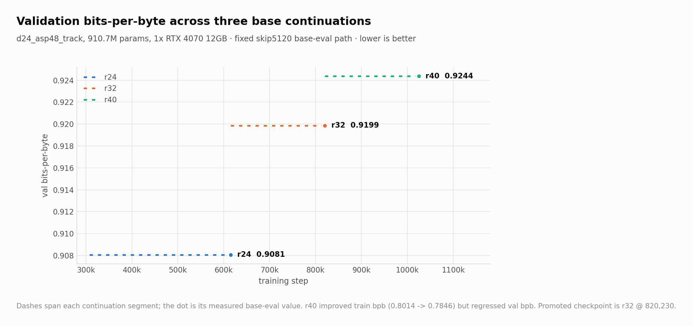
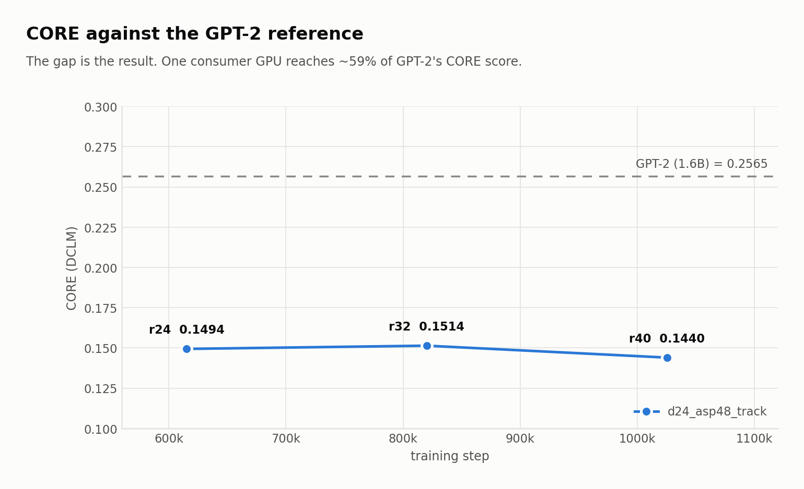
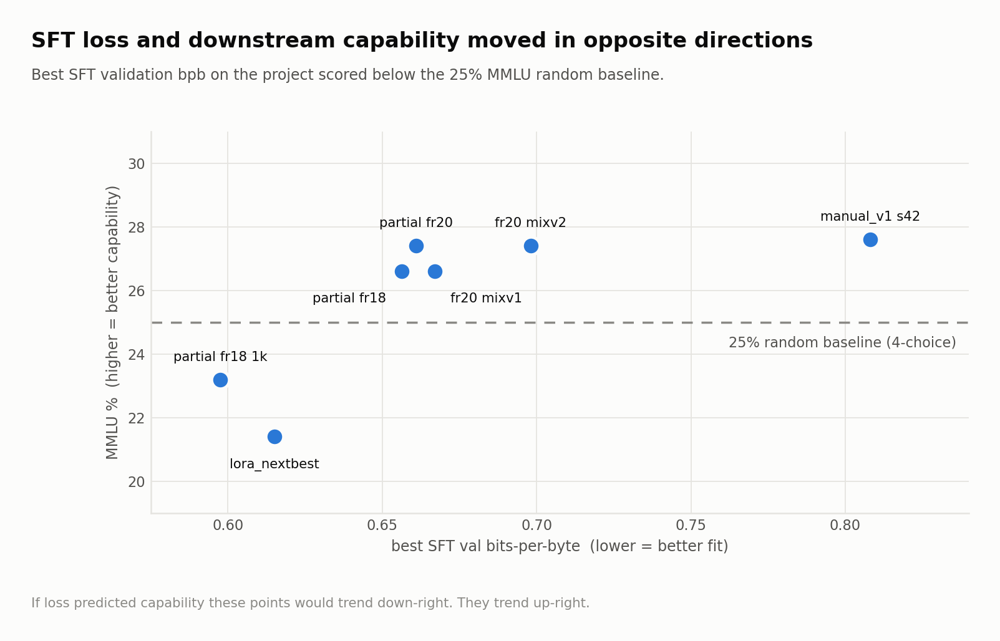
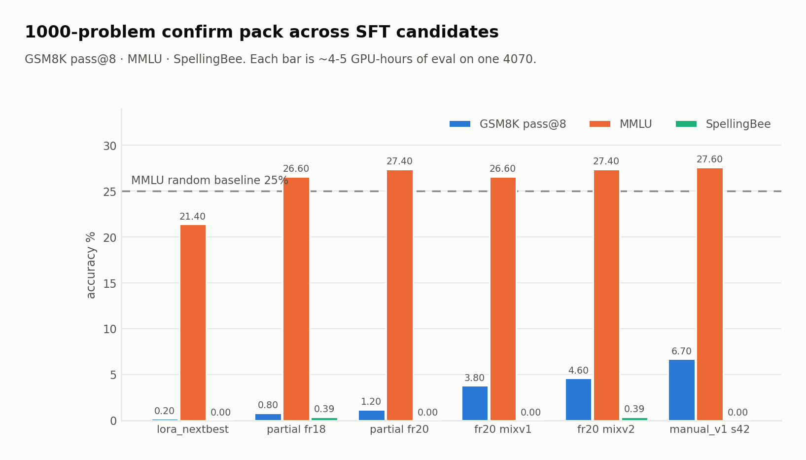
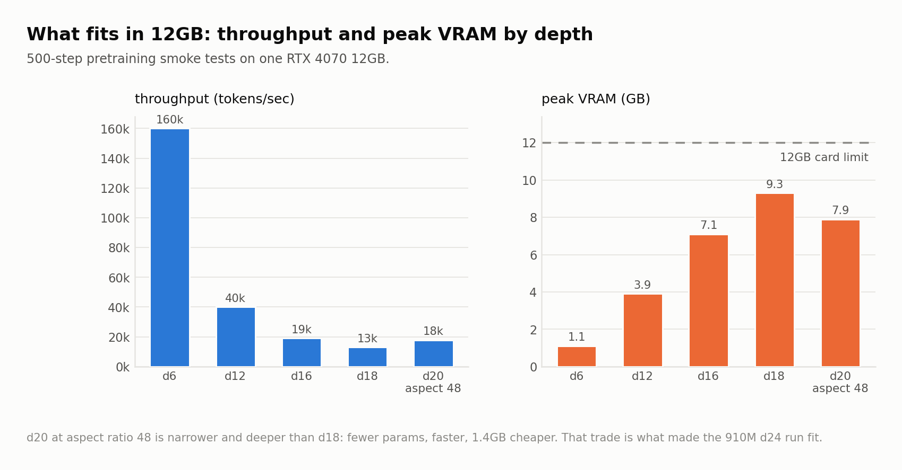

<div align="center">

# nanochat on a single RTX 4070

**What happens when you take an 8×H100 speedrun codebase and force it onto one 12 GB consumer GPU — for 530 GPU-hours.**

[](https://huggingface.co/Marcolini/nanochat-d24-base-champion)
[](https://wandb.ai/sunshines-gmail-com/projects)
[](https://github.com/karpathy/nanochat)
[](LICENSE)

</div>

---

## TL;DR

Upstream [nanochat](https://github.com/karpathy/nanochat) is tuned to beat GPT-2 on an 8×H100 node in about two hours. This fork asks a different question: **how far does the same codebase go on one RTX 4070 12 GB, and what breaks on the way?**

The answer, after ~530 logged GPU-hours across 183 tracked runs:

| | Result |
|---|---|
| **Best base model** | `d24_asp48_track` @ step 820,230 — **910.7 M params**, val bpb **0.9199**, CORE **0.1514** |
| **Best chat model** | partial-FT `mixv2` @ step 300 — GSM8K pass@8 **4.60%**, MMLU **27.40%**, SpellingBee **0.39%** |
| **Peak memory headroom** | 910 M-param training fits in 12 GB via grad checkpointing + an automatic batch-size OOM ladder (4 → 2 → 1) |
| **Honest ceiling** | CORE 0.1514 vs GPT-2's 0.2565. This does **not** beat GPT-2. It gets ~59% of the way there on 1/8th of one node. |

The interesting output of this project is not a leaderboard entry — it is the **infrastructure and the negative results**: a resumable, OOM-resilient, W&B-instrumented training stack, plus 14 documented failed recipes that map the actual ceiling of this hardware.

**Artifacts:** [base model](https://huggingface.co/Marcolini/nanochat-d24-base-champion) · [the eight SFT data mixes](https://huggingface.co/datasets/Marcolini/nanochat-rtx4070-sft-mixes) · [W&B projects](https://wandb.ai/sunshines-gmail-com/projects) · [checkpoint releases](https://github.com/Bl4ckd09/nanochat-on-rtx4070/releases)

---

## Results at a glance

### Base pretraining: three multi-day continuations

<p align="center">
  <a href="https://wandb.ai/sunshines-gmail-com/nanochat">
    <picture>
      <source media="(prefers-color-scheme: dark)" srcset="docs/images/base-val-bpb-dark.png">
      
    </picture>
  </a>
</p>

<p align="center">
  <a href="https://wandb.ai/sunshines-gmail-com/nanochat">
    <picture>
      <source media="(prefers-color-scheme: dark)" srcset="docs/images/base-core-dark.png">
      
    </picture>
  </a>
</p>

> **The finding that cost 132 hours:** extending the target ratio from 32 to 40 improved *training* bpb (0.8014 → 0.7846) but **regressed both selection metrics** — val bpb 0.9199 → 0.9244 and CORE 0.1514 → 0.1440. Longer is not better by default. `r40` is archived as an ablation, not promoted.

### SFT: where the real ceiling turned out to be

<p align="center">
  <a href="https://wandb.ai/sunshines-gmail-com/nanochat-sft">
    <picture>
      <source media="(prefers-color-scheme: dark)" srcset="docs/images/sft-val-bpb-dark.png">
      
    </picture>
  </a>
</p>

<p align="center">
  <a href="https://wandb.ai/sunshines-gmail-com/nanochat-eval">
    <picture>
      <source media="(prefers-color-scheme: dark)" srcset="docs/images/eval-confirm-dark.png">
      
    </picture>
  </a>
</p>

> **The finding that reframed the project:** SFT validation loss and downstream capability *decoupled completely*. The best SFT val bpb on the whole project (0.6151, LoRA r64) produced MMLU **21.4%** — below the 25% random baseline for 4-choice questions. The eventual champion has a **worse** val bpb (0.6981) and 27.4% MMLU. On this stack, val bpb is not a promotion signal.

### The 12 GB fit

<p align="center">
  <a href="https://wandb.ai/sunshines-gmail-com/nanochat">
    <picture>
      <source media="(prefers-color-scheme: dark)" srcset="docs/images/vram-scaling-dark.png">
      
    </picture>
  </a>
</p>

| Depth | Params | Throughput | Peak VRAM | Verdict |
|---|---:|---:|---:|---|
| d6 | 73.5 M | ~160k tok/s | 1.1 GB | trivial |
| d12 | ~280 M | ~40k tok/s | 3.9 GB | GPT-1 scale, comfortable |
| d16 | 537 M | ~19k tok/s | 7.1 GB | first large stable model |
| d18 | ~710 M | ~13k tok/s | 9.3 GB | practical ceiling, stock recipe |
| **d20 (aspect=48)** | **599 M** | **~17.7k tok/s** | **7.9 GB** | narrower width buys depth back |

Trading aspect ratio for width is what made the 910 M-param `d24` run possible at all.

---

## What is mine, and what is Karpathy's

This is an honest fork, not a rebrand. Upstream owns the architecture, the tokenizer, the training loop, and the eval harness. **This fork owns the consumer-GPU viability layer.**

| Area | Upstream `karpathy/nanochat` | This fork |
|---|---|---|
| Target hardware | 8×H100 node | 1× RTX 4070 12 GB |
| Objective | beat GPT-2 CORE as fast as possible | strongest end-to-end pipeline that *fits* |
| Wall clock | ~2 h speedrun | 8–15 min SFT probes · 4–5 h confirm packs · 5–8 day base segments |
| Failure model | rare; restart the run | assumed; every stage has a fallback path |

### Code I wrote or substantially changed

| File | What I added | Why it was needed |
|---|---|---|
| `nanochat/lora.py` | **New.** LoRA modules, merge and load helpers | full fine-tuning of a 910 M model does not fit in 12 GB with AdamW state |
| `nanochat/gpt.py` | chunked cross-entropy; optional gradient checkpointing | the logits tensor alone (32,768 vocab × 2048 seq) was a hard OOM |
| `scripts/chat_sft.py` | LoRA flags, partial-FT layer freezing, assistant-only masking fixes, step-based stopping, resumable checkpointing, W&B project overrides | needed a training loop that survives an 8-hour interruption and a paged optimizer |
| `scripts/chat_eval.py` | W&B logging; a low-memory categorical eval path | MMLU eval itself OOM'd on 12 GB before this |
| `nanochat/core_eval.py` | explicit CORE overflow policies + transparent skipped/evaluated counters | CORE crashed on long prompts; silently skipping would have invalidated comparisons |
| `tools/automation/` | **New, ~40 scripts.** Watchers, OOM ladders, retry chains, eval packs, seed sweeps, promotion gates | see below |

### The automation layer is the actual contribution

Running week-long jobs on a desktop that you also use means failure handling has to be automatic. [`tools/automation/`](tools/automation/README.md) implements:

- **OOM ladder** — a run that dies on VRAM automatically relaunches at the next smaller geometry (`bs 4 → 2 → 1`, `seq 2048 → 1536 → 1024 → 768`) instead of failing the sweep.
- **Resilient CORE eval** — `run_base_eval_core_resilient.sh` detects a CORE crash on long prompts and reruns with `--core-overflow-policy skip --core-max-seq-len 5120`, recording exactly how many items were skipped so results stay comparable.
- **Two-stage promotion gate** — every candidate runs a cheap quick gate (250–500 problems) before earning the expensive 1000-problem confirm pack. The confirm pack costs 4–5 GPU-hours; the gate costs minutes. This is what made 14 negative results affordable.
- **Deterministic seed sweeps** — a recipe is only promoted if *multiple seeds* clear the gate. This rule is why the current chat champion is still labelled **provisional**.
- **Watchers and chained pipelines** — `watch_*`, `auto_*`, `chain_post_training.sh` queue the next stage on PID exit, so base → eval → SFT → confirm runs unattended overnight.

---

## Full results history

### Base training

| Date | Model | Params | Recipe | Compute | Train bpb | Val bpb | CORE | Status |
|---|---|---:|---|---:|---:|---:|---:|---|
| 2026-02-18 | `d18_clean200k_safe` @ 200000 | 701.9 M | safe long-run on the d18 branch | 65.5 h | 0.8476 | 0.9036 | 0.1255 | first solid long run |
| 2026-03-12 | `d24_asp48_track` @ r24 | 910.7 M | depth 24, aspect 48, seq 2048, grad ckpt, OOM ladder | 199.3 h | 0.7992 | **0.9081** | 0.1494 | best val bpb |
| 2026-03-19 | `d24_asp48_track` @ r32 | 910.7 M | same recipe continued to ratio 32 | 132.7 h | 0.8014 | 0.9199 | **0.1514** | ✅ **promoted base** |
| 2026-03-27 | `d24_asp48_track` @ r40 | 910.7 M | same recipe continued to ratio 40 | 132.8 h | **0.7846** | 0.9244 | 0.1440 | archived ablation |

*Compute time for r24/r32/r40 is the continuation segment measured from the trainer's cumulative clock between saved checkpoints, not a single uninterrupted run from step 0. All base-eval numbers use the fixed `skip5120` eval path — inline trainer validation is a different measurement and is not used for selection.*

### SFT / chat

All runs adapt `d24_asp48_track @ 820230`. Mixture: SmolTalk + MMLU auxiliary train + 6× GSM8K + identity JSON + SimpleSpelling + SpellingBee.

| Date | Run | Recipe | Val bpb | GSM8K p@8 | MMLU | SpellingBee | Status |
|---|---|---|---:|---:|---:|---:|---|
| 2026-03-27 | `lora_nextbest` | LoRA r64, lr 1e-4, seq 1536, 1000 steps | **0.6151** | 0.20% | 21.40% | 0.00% | best loss, worst capability |
| 2026-03-28 | `adamw_partial_lr005` | partial FT, freeze 18, seq 1024, 300 steps | 0.6563 | 0.80% | 26.60% | 0.39% | first viable non-LoRA control |
| 2026-03-28 | `adamw_partial_lr005_1k` | same, extended to 1000 steps | 0.5975 | 0.40% (p@1) | 23.20% | — | longer regressed |
| 2026-03-28 | `adamw_partial_fr20` | partial FT, freeze 20, 300 steps | 0.6610 | 1.20% | 27.40% | 0.00% | conservative freeze wins |
| 2026-03-29 | `fr20_mixv1` | + `reasoning_focus_v1` mix | 0.6670 | 3.80% | 26.60% | 0.00% | first data-mix win |
| 2026-03-29 | **`fr20_mixv2`** | + `reasoning_focus_v2`, seq 768 | 0.6981 | **4.60%** | **27.40%** | **0.39%** | ⚠️ **provisional champion** |
| 2026-04-01 | `reasoning_manual_v1` seed 42 | manual curated JSONL | 0.8081 | **6.70%** | 27.60% | 0.00% | best observed, **unstable** |

### Why the champion is still "provisional"

`mixv2` is the strongest single confirmed run on this project. It is not promoted outright because it failed its own reproducibility rule:

- direct replication failed the quick gate
- a deterministic 3-seed sweep failed **0/3**
- `mixv3`, `mixv4`, curriculum, stage-B boosters, and curated-v1 all failed to beat it

Reporting it as provisional rather than as a headline number is a deliberate choice. Single-run results at this scale are within seed noise, and the seed sweep is the evidence.

---

## Negative results

Fourteen recipe branches were run to completion and closed as failures. They are documented here because on fixed hardware, knowing which levers are exhausted is the expensive knowledge.

| Branch | What was tried | Outcome |
|---|---|---|
| `mixv3`, `mixv4` | further static mix reweighting | quick-gate fail / below champion |
| `curriculum_v1` | two-stage curriculum | stage-B gate fail |
| `stageb_booster_v1/v2` | softer stage-B boosters | did not beat champion |
| `reasoning_curated_v1` | curated reasoning set | both seeds failed at 500-problem gate |
| `reasoning_manual_v2` | broader manual set, less oversampling | removed the v1 spike, lost MMLU |
| `teacher_reasoning_v1b/v2/v3` | teacher-selected mixes from OpenThoughts-114k, OpenR1-Math-220k, filtered Magpie-Ultra | all failed internal or quick gates |
| `teacher_distilled_v1/v2` | distilled short-answer mixes, source-balance quotas | both failed the internal loss gate before external eval |

**Conclusion drawn from the whole set:** the bottleneck stopped being VRAM around `mixv2`. It became recipe robustness and data quality. Further `mixvN`-style sweeps on this backbone have no expected value. The next real improvement requires a materially different lever — qualitatively better teacher data, a stronger base, different hardware, or narrow specialist branches instead of one generalist chat model.

**The mixes themselves are published**, so the comparison can be checked rather than taken on trust: [`Marcolini/nanochat-rtx4070-sft-mixes`](https://huggingface.co/datasets/Marcolini/nanochat-rtx4070-sft-mixes) carries all eight as loadable configs, each with the result it produced.

Full decision records: [`notes/project_state_2026-04-04.md`](notes/project_state_2026-04-04.md) · [`report_v3.md`](report_v3.md)

---

## Setup

| Component | This machine |
|---|---|
| OS | Windows 11 + WSL2 (Ubuntu) |
| CPU | Intel i7-13700K |
| RAM | 64 GB |
| GPU | NVIDIA RTX 4070 **12 GB** |
| Pretraining data | [`karpathy/fineweb-edu-100b-shuffle`](https://huggingface.co/datasets/karpathy/fineweb-edu-100b-shuffle) |
| Tracking | W&B projects [`nanochat`](https://wandb.ai/sunshines-gmail-com/nanochat) · [`nanochat-sft`](https://wandb.ai/sunshines-gmail-com/nanochat-sft) · [`nanochat-eval`](https://wandb.ai/sunshines-gmail-com/nanochat-eval) |

## Reproducing this

```bash
git clone https://github.com/Bl4ckd09/nanochat-on-rtx4070
cd nanochat-on-rtx4070
uv sync && source .venv/bin/activate
export WANDB_ENTITY=<your-entity>
```

Base continuation on a 12 GB card:

```bash
python -m scripts.base_train \
  --depth=24 --aspect-ratio=48 --max-seq-len=2048 \
  --device-batch-size=4 --total-batch-size=16384 \
  --grad-checkpointing=1 \
  --run="d24_asp48_track"
```

Partial fine-tune with the champion recipe:

```bash
bash tools/automation/run_sft_adamw_control_nextbest.sh   # partial FT, freeze_layers=20
bash tools/automation/run_chat_eval_confirm_1k.sh <run_tag>  # 1000-problem confirm pack
```

Regenerate every chart in this README from W&B:

```bash
python tools/reporting/export_wandb_charts.py --entity sunshines-gmail-com
# or, without W&B access, chart the committed milestone tables:
python tools/reporting/export_wandb_charts.py --offline
```

It writes light- and dark-mode PNG pairs into `docs/images/`, which is why the charts above adapt to your GitHub theme.

If a run dies on VRAM, do not lower the batch size by hand — the automation scripts carry the ladder. See [`tools/automation/README.md`](tools/automation/README.md).

## Using the model

```bash
pip install torch safetensors tokenizers huggingface_hub
huggingface-cli download Marcolini/nanochat-d24-base-champion --local-dir ./ckpt
python load_example.py --ckpt ./ckpt
```

This is **not** a stock `transformers` model: rotary embeddings, QK-norm, relu² MLP, untied embeddings, GQA, ResFormer value embeddings, and per-layer `resid_lambdas` / `x0_lambdas` scalars. Load it with the nanochat `GPT` class from this repo.

---

## Upstream

Everything above is a fork-specific layer on top of Andrej Karpathy's [nanochat](https://github.com/karpathy/nanochat). For upstream documentation — the 8×H100 speedrun, the leaderboard, scaling-law scripts, and the chat web UI — see [`docs/UPSTREAM_README.md`](docs/UPSTREAM_README.md) and the [upstream repo](https://github.com/karpathy/nanochat).

**AI disclosure** (following upstream policy): the automation layer under `tools/automation/` and portions of the LoRA and partial-FT plumbing were written with substantial LLM assistance and then reviewed, debugged, and validated against real runs by me. Experiment design, promotion rules, and all result interpretation are mine.

## Citation

```bibtex
@misc{nanochat,
  author = {Andrej Karpathy},
  title  = {nanochat: The best ChatGPT that \$100 can buy},
  year   = {2025},
  publisher = {GitHub},
  url    = {https://github.com/karpathy/nanochat}
}
```

MIT, as upstream.
